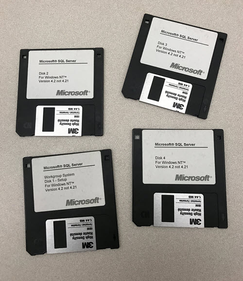

## A bit about me

I've been working with data since 1995 and started on SQL Server 4.21 on OS/2 Warp. Anyone else remember that, or am I just getting a bit old now? I remember spending an afternoon installing it from a big pile of floppies. 

After a year or so I moved over to SQL Server on Windows NT 3.51 and then NT 4.0, Windows 2000, etc. I've worked with a lot of different technologies but it's always focused around data, usually on the Microsoft platform.

I spend most of my professional time now doing technical architecture and consulting for clients using Microsoft Azure, again with a focus on data, but also I have developed an interest in automation and continuous delivery of data platforms in the Cloud.

## Certified

From 2002-2005 I received the MVP award for SQL Server, but kids came along and I didn't keep that up.

## Crazy stuff :grinning:

My passion outside of messing around with shiny IT toys, is flying my paramotor. These are my top ten flights of 2022.



If you want to see more videos of my flying, have a peek at my [:(fab fa-youtube fa-fw): YouTube channel](https://www.youtube.com/@markallisonparamotor).

I've also taken some hires photos of my flying in 2022 [here](https://markallison.smugmug.com/Other/Paramotoring/2022/2022-Photo-Book/).

