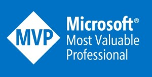

## A bit about me

I've been working with data since 1995 and started on SQL Server 4.21 on OS/2 Warp. Anyone else remember that, or am I just getting a bit old now? I remember spending an afternoon installing it from a big pile of floppies. After a year or so I moved over to SQL Server on Windows NT 3.51 and then NT 4.0, Windows 2000, etc. I've worked with a lot of different technologies but it's always focused around data, usually on the Microsoft platform.

I spend most of my professional time now doing technical architecture and consulting for clients using Microsoft Azure, again with a focus on data, but also I have developed an interest in automation and continuous delivery of data platforms in the Cloud.

### Old blog posts
Can be found here at [Sabin.io](https://sabin.io/blog/author/Mark%20Allison)

## Certified

I recently (March 2021) became a Microsoft certified Azure Solutions Architect Expert. 

{{< style "img { height: 200px; }" >}}



[Verify here](https://www.youracclaim.com/badges/513d9704-2878-4fd0-b0e7-f43a423af51c/linked_in)

From 2000-2006 I received the MVP award for SQL Server, but kids came along and I didn't keep that up.

## Crazy stuff :grinning:

My passion outside of messing around with shiny IT toys, is flying my paramotor. Here's a summary video of my flying from 2020.



If you want to see more videos of my flying, have a peek at my [:(fab fa-youtube fa-fw): YouTube channel](https://www.youtube.com/user/keymoo/videos).
