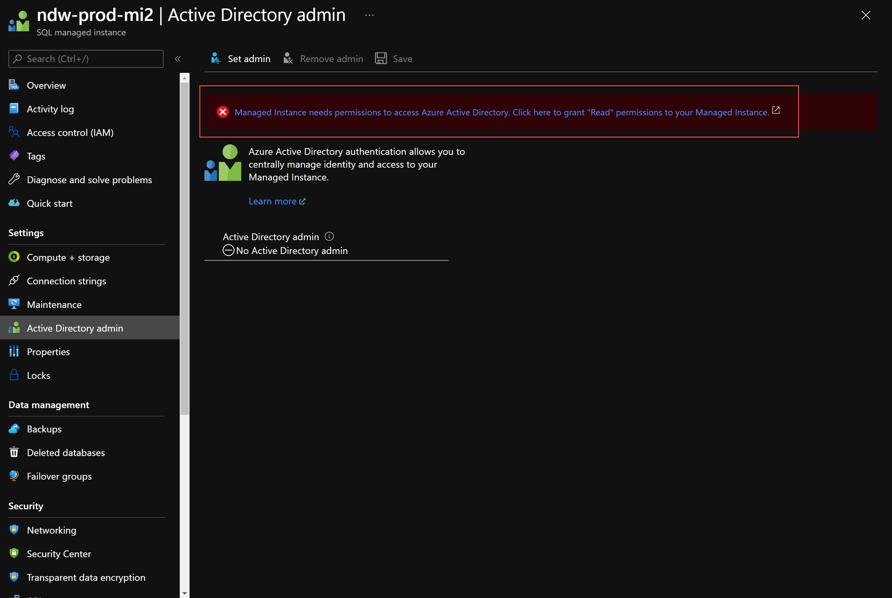
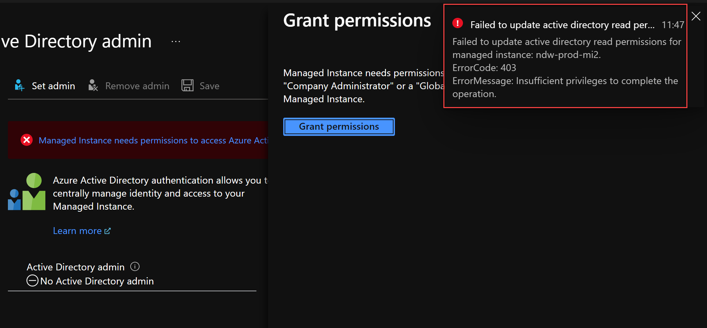
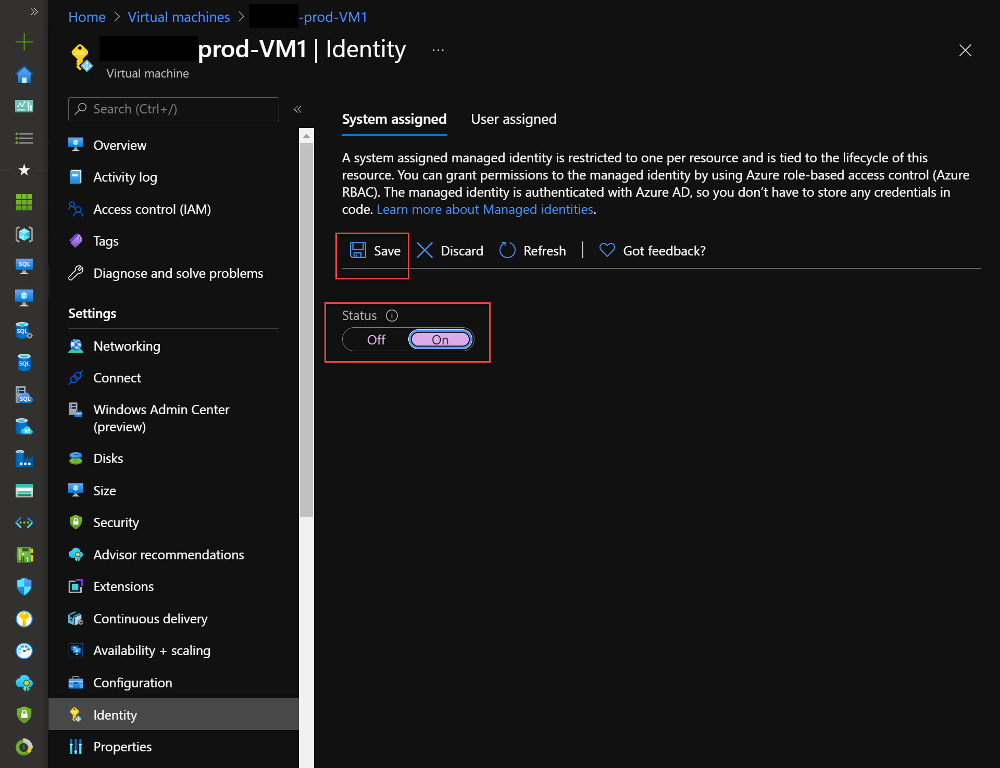

Consider the scenario where some PowerShell scripts need to be scheduled on an Azure virtual machine, which connects to an Azure SQL Managed Instance.

The PowerShell script needs to run on a schedule and must be able to connect to the managed instance securely. You would rather not have to manage passwords.

What's the best way to do this? You guessed it, **Managed Identity**. This post will describe two ways of doing it, one using Azure AD with a Managed Identity and one using SQL Authentication and Azure Key Vault using a **Service Principal**.

## Pre-Requisites

### Managed Instance AD Admin

For solution 1 using Azure AD we must ensure that the Managed Instance is registered in Azure AD and has permissions to read Azure AD. [Read the docs here from Microsoft](https://docs.microsoft.com/en-gb/azure/azure-sql/database/authentication-aad-overview) but the upshot is in the Azure Portal you will see this in the Active Directory Admin section.



An administrator of Active Directory needs to grant the Managed Instance access to read Azure AD by clicking on the Grant button shown here. If this is tried without the correct permission, you will get the error shown.



Once this is done, an Active Directory user or group needs to be set as the AD admin. 

The SQL Managed Instance will now be able to authenticate managed identities against Azure AD because it  now has permission to read the directory.

### Create Managed Identity for the Virtual Machine

I'm a big advocate of *infrastructure-as-code* for repeatable, reliable, predictable infrastructure that is easy to recover with less hassle so will show the ARM template method first.

Assuming that you have an ARM template to deploy your VMs... you haven't? Get to it right away! Even better, if you want to live on the edge, have a [bicep](https://docs.microsoft.com/en-us/azure/azure-resource-manager/bicep/overview) template.

In the resources section of the ARM template for resource type `Microsoft.Compute/virtualMachines` add this section at the same level as the `"type"`

```json
      "identity": {
        "type": "SystemAssigned"
      }
```      

for example

```json
      "name": "[parameters('vmName')]",
      "type": "Microsoft.Compute/virtualMachines",
      "apiVersion": "2019-03-01",
      "location": "[parameters('location')]",
      "identity": {
        "type": "SystemAssigned"
      },
```

This will create a System-Assigned Managed Identity for the virtual machine allowing the virtual machine to run scripts and authenticate against resources in Azure.

For completeness and I don't recommend you do it this way, here's how to do it in the Azure Portal. Why are you using the portal? How will you set everything up correctly in a disaster?

Go to `Virtual Machines -> Your VM -> Identity`. On the **System-Assigned** tab, switch **Status** to **On**, then click **Save**. That's it!



## Set up
### Permit the VM access to the SQLMI

Now that you have the Azure AD stuff out of the way, the SQLMI needs to permit the virtual machine to access it. This is done by creating a login and then assigning the minimum level of permissions to the VM.

#### Create a login

In the SQLMI, create a login with

```sql
CREATE LOGIN [my-vm-name] FROM EXTERNAL PROVIDER;
```

where **my-vm-name** is the name of the VM in Azure.

#### Assign permissions to databases

For example, let's say for a database called **Admin**, the scripts on the VM need to have **db_owner** permissions in this database.

```sql
USE [Admin]
GO
CREATE USER [my-vm-name] FOR LOGIN [my-vm-name]
ALTER ROLE [db_owner] ADD MEMBER [my-vm-name]
GO
```

Any script running on the VM using the **ManagedIdentity** security context, will now have **db_owner** permission on the SQLMI. I will show you how to use it in your PowerShell scripts in a second.

## Using a Service Principal

If you using an on-premises machine, or a VM in another public cloud such as AWS, it is also possible to grant access using Azure AD, however a Managed Identity is not possible, but the next best thing, a service principal can be used. The downside to this is, the secret for the Service Principal must be known by the script, so there must be a way to securely store this secret and **not have it in plain text** embedded in the script!

Steps required using a Service Principal with PowerShell:

In a PowerShell window, connect to the Azure AD subscription where the Managed Instance resides with a user account that has Owner or Contributor permissions.

```powershell
Connect-AzAccount -Subscription "{Your subscription name}"
```

Now create a Service Principal with this command and change the Display Name for this principal to something sensible.

```powershell
$servicePrincipal = New-AzADServicePrincipal -DisplayName "marktest-automation-sp"
```

You may see a warning like this which tells you the Service Principal has Contributor permissions on the subscription.


WARNING: Assigning role 'Contributor' over scope '/subscriptions/c73050d4-021f-428a-af6a-2af98db55a1e' to the new service principal.


Let's have a look at the contents of `$servicePrincipal`

```powershell
$servicePrincipal

Secret                : System.Security.SecureString
ServicePrincipalNames : {94835b16-4256-4717-bf1e-7ef9be86e49c}
ApplicationId         : 94835b16-4256-4717-bf1e-7ef9be86e49c
ObjectType            : ServicePrincipal
DisplayName           : marktest-automation-sp
Id                    : 8629bad7-511d-4b63-9261-2a488fcee183
Type                  : ServicePrincipal
DeletionTimestamp     :
AdditionalProperties  :
```

The Service Principal will have a secret created with it. This can be viewed with 

```powershell
$servicePrincipal.Secret | ConvertFrom-SecureString -AsPlainText
```

After closing the PowerShell session there will be no way to view this secret again, you will have to create a new one, so ensure it is stored securely somewhere.

The process to grant access to the SQLMI is much the same as with a Managed Identity.

```sql
USE [master]
GO
CREATE LOGIN [marktest-automation-sp] FROM EXTERNAL PROVIDER;
GO
USE [Admin]
GO
CREATE USER [marktest-automation-sp] FOR LOGIN [marktest-automation-sp]
ALTER ROLE [db_owner] ADD MEMBER [marktest-automation-sp]
GO
```

The downside of using a Service Principal, as mentioned earlier, is the requirement to know the secret. Managed Identities don't have this problem. The secret could be obtained from Key Vault or some other secure method.

## Connecting to the SQLMI in a script

### Managed Identity

Now that everything is configured, your script will need to authenticate with Azure from the VM.

```powershell
Connect-AzAccount -ManagedService -Subscription "{Your subscription name}"
```

The Azure PowerShell session is now running under the context of the Managed Identity. A token from AAD is required to connect to the SQLMI which verifies that the connection is coming from the VM Managed Identity. 

```powershell
$token = (Get-AzAccessToken -ResourceUrl https://database.windows.net).Token
```

Think of this token like a credential which can be passed to `Invoke-SqlCmd`

```powershell
Invoke-Sqlcmd -ServerInstance "managedinstancename.2cf24dba5fb0.database.windows.net" -Database Admin -Query "select Count(*) from dbo.MyTable" -AccessToken $token
```

That's it! Easy! 😂

### Service Principal

Connecting with a Service Principal is much the same as a Managed Identity except a secret must be passed to Azure to prove that we have the secret.

```powershell
# define variables to authenticate
$tenantId = (Get-AzContext).Tenant.Id
$username = "94835b16-4256-4717-bf1e-7ef9be86e49c" # the ApplicationId
$password = ConvertTo-SecureString "{THE_SECRET}" -AsPlainText -Force
$credential = New-Object System.Management.Automation.PSCredential ($username, $password)
```

Once the information required to connect has been gathered, a secure connection to Azure is established with

```powershell
Connect-AzAccount -ServicePrincipal -Credential $credential -Tenant $tenantId -Subscription "{Your subscription name}"
```

To connect to the SQLMI, a token is required, much like a Managed Identity, so connect with:

```powershell
$token = (Get-AzAccessToken -ResourceUrl https://database.windows.net).Token
Invoke-Sqlcmd -ServerInstance "managedinstancename.public.2cf24dba5fb0.database.windows.net,3342" -Database Admin -Query "select Count(*) from dbo.MyTable" -AccessToken $token
```

## In summary

* Set up Azure AD for your Managed Instances so they can read the directory
* Use Managed Identities to connect to SQLMI from Azure Resources
* Use Service Principals for non-Azure resources (on premises, aws)
* Stop using plaintext SQL Authentication!

Happy scripting!