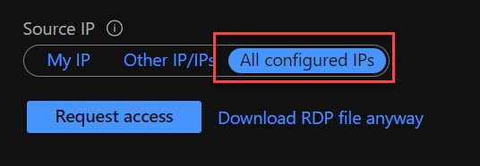

An issue came up this week where some external consultants needed access to remote onto an Azure Windows VM to configure a third-party application. The consultants were given AAD logins and are working from home with dynamic IP addresses.

What is the best way to grant them access to RDP onto the VM?

The preferred method would be via a private endpoint into the VNet via point-to-site VPN or Bastion, but external consultants can't be granted access that way.

## Just-in-time (JIT)

There aren't any built-in roles in Azure to allow a user to request access to the VM via JIT with the principle of least-privilege, so a custom role is required. However, what permissions are needed? This took some time to [discover](https://docs.microsoft.com/en-us/azure/security-center/just-in-time-explained#what-permissions-are-needed-to-configure-and-use-jit). Create a custom role with these permissions and it should work fine when users are assigned to the role.

Assign these permissions to the role:

* On the scope of a subscription or resource group that is associated with the VM: `Microsoft.Security/locations/jitNetworkAccessPolicies/initiate/action`
* On the scope of a subscription or resource group that is associated with the VM:
`Microsoft.Security/locations/jitNetworkAccessPolicies/*/read`
* On the scope of a subscription or resource group or VM:
`Microsoft.Compute/virtualMachines/read`
* On the scope of a subscription or resource group or VM:
`Microsoft.Network/networkInterfaces/*/read`

## Behind the scenes

Azure will create inbound security rules behind the scenes and add them to the network security group. After a time-boxed period, the rule gets removed.

However there is a catch. Users are able to select All configured IPs which means any IP address will have access to the VM. 

How to prevent this? Set up an [Azure Policy](https://techcommunity.microsoft.com/t5/azure-architecture-blog/azure-policy-prevent-the-use-of-wildcard-for-source-in-azure/ba-p/1783844) that prevents Any rules from Source IP.