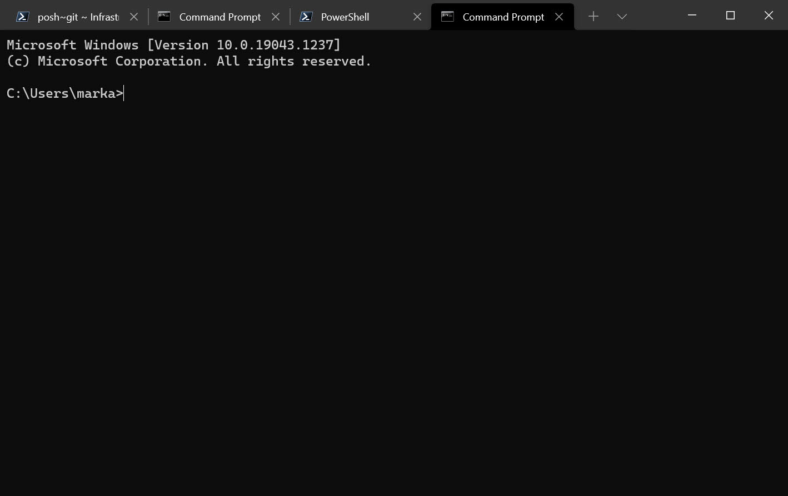

Windows Terminal was released in 2019 for Windows 10 on the Microsoft Store, and I only just found out about it. Not sure why I've been living under a rock all this time, but I'm absolutely loving this app.

I found out about it after playing around with the GA release of Windows 11 last week and noticed that Windows Terminal was installed as part of the default build of the Windows Pro edition.

I then wondered if it would be in the Windows Store and available for Windows 10, and it turns out it's been there for two years!

It's also open source and you can contribute and view the [source code](https://github.com/microsoft/terminal). Amazing!

## Why is Windows Terminal so good?

### Tabbed windows

Not much else to say really, I've been wanting tabs in my terminal like my Linux friends as long as I've been using tabs in Google Chrome.

### Tabbed windows on steroids

What my linux friends, **can't do** though, (as far as I'm aware) is have tabbed windows with different terminals in them:

Not only that, but each different terminal can have it's own colour profile plus other settings so I can make them look however I want. For example here's the ubuntu terminal running natively on Windows 10 in Windows Terminal:

### Easy access to Settings

It feels a bit like Visual Studio Code, where CTRL-Shift-P brings up the settings pane.

### Split windows

Windows can be split as well both horizontally and vertically. How cool is that? Makes working in the command line so much more enjoyable than it already is. 😉

If you can't remember the command to split the window, just CTRL-Shift-P and type split, and there you go! Beautiful.

## Get it now

Go and search for it on the Microsoft Store. It's lovely. 


Don't install it from the GitHub page because you won't receive automatic updates, the Microsoft Store version will keep it updated.


